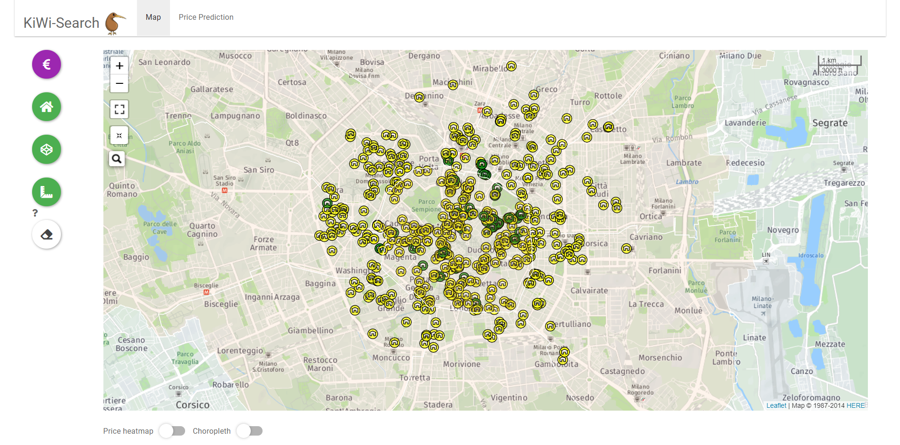
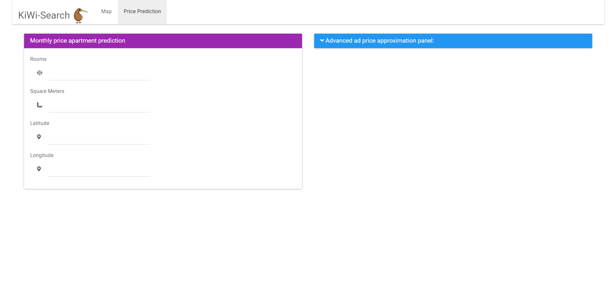
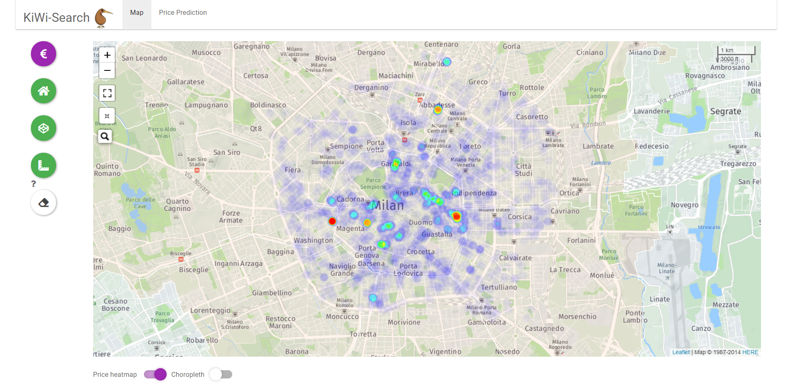
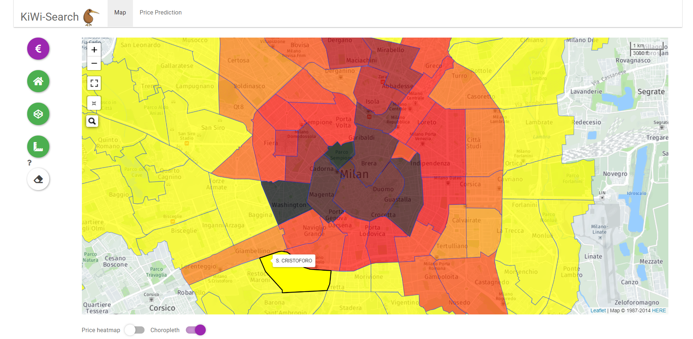

<!-- README.md is generated from README.Rmd. Please edit that file -->


# KiWi Reeesearch 
_author_: **[Niccolò Salvini](https://niccolosalvini.netlify.app/)** , **[Jędrzej Dziedziul](https://www.linkedin.com/in/jedrzej-dziedziul/)**

_date_: `r Sys.Date()`


```{r global.options, include=FALSE}
knitr::opts_chunk$set(
  warning = FALSE,  
  strip.white = TRUE,     # if FALSE knitr will not remove white spaces at the beg or end
  fig.path = "img/",      # file path to the directory DESTINATION where knitr shall store the
  fig.width=12,           # the width for plots created by code chunk
  fig.height=8,           # the height for plots created by code chunk
  cache = FALSE           # if TRUE knitr will cache the results to reuse in future knits
)


knitr::knit_hooks$set(imgcenter = function(before, options, envir){  # to center image 
  if (before) {                                                      # add imgcenter = TRUE
    htmltools::HTML("<p align='center'>")                            # to the chunk options
  } else {
    htmltools::HTML("</p>")
  }
})
```

<br> <br> 


## Deployment happens:

--> see the _slides_ **[HERE](https://kiwiresearch.netlify.com/#1)**
--> see the _Shiny APP_ **[HERE](https://jedrzejdziedziul.shinyapps.io/Housing/)**

## Description:

This tool has been designed to explore apartements in Milan next to your preferred location and compute a monthly rent price estimation given the spatial coordinates and the expected characteristics of the house, such as: rooms square meters. It is composed by a `Shiny` deployed from a bitbucket repo into [shinyapps.io](https://www.shinyapps.io/) and a set of `xaringan` slides deployed on [Netlify](https://www.netlify.com/). House data are scraped from [immobiliare](https://www.immobiliare.it/). Full explanation on the slides.


## Visuals:

```{r graphics, echo=FALSE, imgcenter = TRUE}
 
```

```{r graphics2, echo=FALSE, imgcenter = TRUE}
 
```

```{r graphics3, echo=FALSE, imgcenter = TRUE}
 
```

```{r graphics4, echo=FALSE, imgcenter = TRUE}
 
```

## Dependecies

```{r}
libs = c("rvest", "magrittr", "stringr", "httr",
"furrr", "plotly", "ggplot2", "DT", "readxl", "dplyr")

new.packages = libs[!(libs %in% installed.packages()[,"Package"])]
if(length(new.packages)) install.packages(new.packages)
```

## Usage:
the first tab-panel in the tab-set let you explore the available houses on the Milano house market, then once you have find the location of the apartement you right click it. This will assign a marker in `leaflet` object. This marker will be cached in the second tab panel, the *price prediciton calculator*, where you can also specify other characteristics of the desired house. An autoML model will give the estimation in the lower down part on the left.  
In the right drop-down column you can discover other further options to select and the autoML will do its job in parallel. 

## Project status:
this project is still `IN ITINERE`, but it has stopped since my university class is completed.

## Next features:

- implement auto-scraping functions
- choose boostrap .css style 
- better UX

## License:

<a rel="license" href="http://creativecommons.org/licenses/by/4.0/"></a><br />Quest'opera è distribuita con Licenza <a rel="license" href="http://creativecommons.org/licenses/by/4.0/">Creative Commons Attribuzione 4.0 Internazionale</a>.
